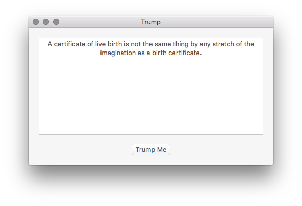

<!--# Trump -->
# Trump

Trump is a simple Mac application to helps you win arguments by making dull-witted, bigotted statements that can win over a mass 
majority by manipulating generalized opinions and toying with others rooted ideologies. Just like how Hitler empowered the German 
people by blaming everything on the Jews, you can win any debate with help from Donald Trump himself.

Inspired by Josh's [rand-paul](https://github.com/trommel/rand-paul).

### Screenshots 
<!---->

<!---->

### References
1. [Inside Gov](http://presidential-candidates.insidegov.com/stories/5187/23-ridiculously-offensive-donald-trump-quotes)
2. [Trump is Literally Hitler](http://trumpisliterallyhitler.com)

###### Made with hate and intolerance by Samuel Steele
